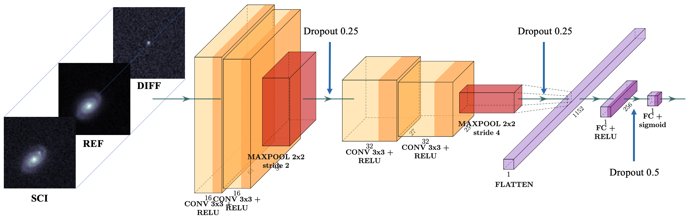

# `braai` \[Bogus/Real Adversarial AI\]
## Real-bogus classification for the Zwicky Transient Facility using deep learning

Efficient automated detection of flux-transient, reoccurring flux-variable, and moving objects 
is increasingly important for large-scale astronomical surveys. `braai` is a convolutional-neural-network, 
deep-learning real/bogus classifier designed to separate genuine astrophysical events and objects 
from false positive, or bogus, detections in the data of the [Zwicky Transient Facilty (ZTF)](https://ztf.caltech.edu), 
a new robotic time-domain survey currently in operation at the Palomar Observatory in California, USA.
`braai` demonstrates a state-of-the-art performance as quantified by 
its low false negative and false positive rates.

### `braai` architecture

### Dataset

todo: plots  

### Classifier performance

todo: plots 

### Use `braai`

todo: jupyter notebook: find a nice SN on Kowalski, grab it from mars.lco.global, make triplet, run braai

#### Edge TPU

### Train your own `braai`